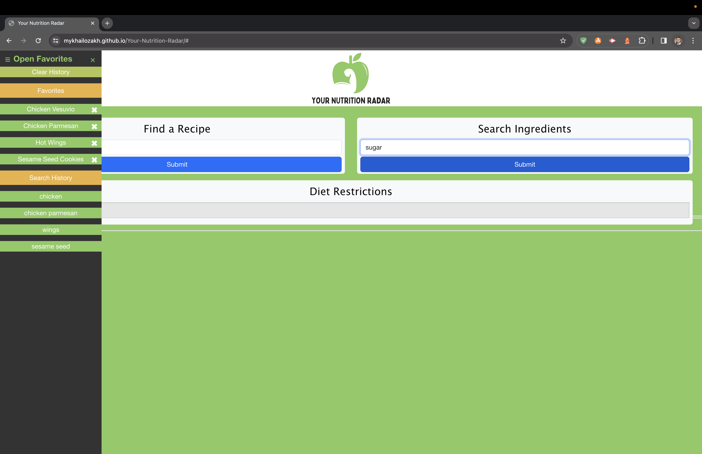

# Your-Nutrition-Radar
Web Application for recipe with nutrition

## Purpose

The purpose of this app is to provide searchable meals, ingredients, recipes, and nutrition facts to the end user. One can filter by diet type as well to find the right meal to fit one's needs.

## Functionality

Upon searching, the recipes, ingredients, and nutrition facts are generated below the search bars as well as the right sidebar. One can click any of the search results, and the right navbar will update accordingly. The application is optimized for mobile screens.

## Built With
Bootstrap - Formatting and Layout
Edamam - API for Food Data

## Link and Screenshots
Deployment URL: https://mykhailozakh.github.io/Your-Nutrition-Radar/
 
 

## Contributors
<li>Evan Beck: https://github.com/Evan-Beck </li>
<li>Kenny Cummings: https://github.com/kennycummings </li>
<li>Ryan Sauter: https://github.com/RedKnight88 </li>
<li>Mykhalio Zakharkiv: https://github.com/MykhailoZakh </li>
